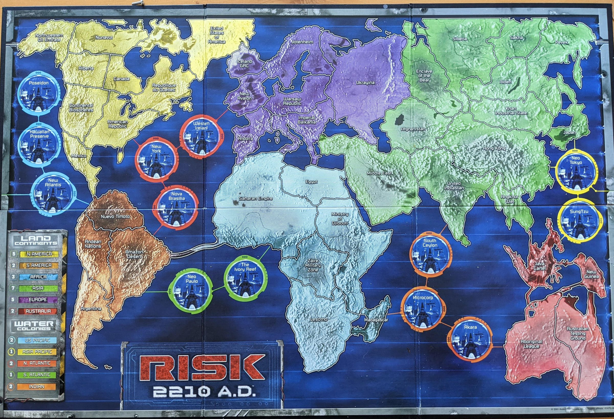

# Risk 2210 A.D. — browser edition

A complete digital adaptation of the 2001 Avalon Hill board game, played over a photo of the
physical board. TypeScript + Vite, no UI framework — the game loop is a plain async "coroutine"
that awaits clicks, which doesn't need a component framework wrapped around it.

**Play it right now, no download:** https://stevezg.github.io/risk2210ad/



You play RED against the BLUE machine intelligence; a neutral GRAY army holds the ground
between you (the official 2-player rules).

## Development

```sh
npm install
npm run dev      # local dev server with hot reload, http://localhost:5173
npm run build    # type-checks, then builds the static site into docs/ (what GitHub Pages serves)
npm run preview  # serve the docs/ build locally to sanity-check it before pushing
```

Source lives in `src/`, split by concern: `data.ts` (board graph, command cards), `state.ts`
(game state and pure queries), `render.ts` (DOM rendering, tooltips, effects), `ui-events.ts`
(the click/prompt event loop), `combat.ts`, `cards.ts`, `human-phases.ts`, `bot.ts`,
`turn-flow.ts` (the year/turn loop), and `main.ts` (boot). `index.html` is Vite's entry point —
same markup as before, now loading `src/main.ts` as a module instead of an inline `<script>`.

For console-based testing (e.g. running bot-vs-bot games headlessly to check AI behavior),
`main.ts` exposes `window.debug = { state, render, turnFlow, start }` — e.g.
`debug.state.newGame(true); debug.turnFlow.runGame();` then inspect `debug.state.S`.

## Playing

Bid energy secretly for turn order, then recruit MODs, hire commanders, build Space Stations
and buy command cards, invade, and fortify — highest score after the last year wins. Click a
territory to select it; legal targets light up. Cards in your hand glow when they can be played,
and hovering one explains what it does and why. The comms log under the board narrates every roll.

Pick how many years to play on the title screen (3/5/7/10, default 5 — the official length).
When the game reaches that limit you get a checkpoint: current standings, and a choice to stop
for final scoring or keep playing 1/3/5 more years. You can keep extending indefinitely.

* `board_photo.jpg` / `moon_photo.jpg` — the Earth board and the lunar board. Territory nodes are
  placed with CSS percentages so they stay locked to the artwork at any window size (`TDEF`).
* The **EARTH / MOON** buttons (top-left of the map) switch boards; the button for the board you
  are not looking at shows a badge counting the highlighted territories waiting there. Landing
  sites (Sea of Crisis, Bay of Dew, Tycho) carry a gold ring.
* `cover.jpg` — box art on the title screen. `gunship.ttf` — Gunship by Iconian Fonts
  (free for non-commercial use).

## Map data

Adjacency is transcribed from the official board and lunar schematics (Wikimedia Commons),
extracted geometrically rather than by eye: each connector path was walked with the SVG
`getPointAtLength` API and split at every territory circle it passes through. Notable
corrections over a by-eye reading of the board photo: **Nova Brasilia connects to Amazon
Desert** (not Nuevo Timoto, and not to Saharan Empire), **Poseidon connects to Continental
Biospheres** (not the Northwestern Oil Emirate), **Sung Tzu connects to New Guinea** (not Java
Cartel), Hawaiian Preserve has no link to Mexico, and Saharan Empire borders Imperial Balkania
as well as Andorra. The two Pacific links that run off the edges of the board wrap around:
Northwestern Oil Emirate–Pevek and **New Atlantis–Neo Tokyo** (confirmed against the connector
lines running off both edges of the physical board photo — not Hawaiian Preserve, which has no
wrap link at all). The Moon uses all 30 edges of the lunar schematic, and Earth↔Moon travel is
only possible through the three lunar landing sites (Sea of Crisis, Bay of Dew, Tycho), each
reachable solely from a Space Station on Earth.

Implements the 2001 gameplay manual and FAQ: sealed-bid turn order, income in MODs and energy,
commanders with the d8 table, Space Stations (d8 defence, launches to the Moon), water/Moon
gating, all five base-game command decks with their effects, 3-territory bonus, elimination,
fortify chains through stations and landing sites, a configurable/extendable game length (see
above) and final scoring with Colony Influence (+3) and energy/unit tie-breaks. Armageddon is
simplified to "your nuclear cards are free this turn".

## Multiplayer (in progress)

This is currently a single-player game (you vs. one bot, locally, in your browser). A C++
multiplayer server that lets people on different computers play the same live game together is
in active development in `server/` — see [ARCHITECTURE.md](ARCHITECTURE.md) for the design and
current status. The rules engine itself (2-5 players, every card, fully generalized from the
browser version's 2-player-only rules) is built and passing a 2,000-game self-play fuzz test;
the networking layer and AI personalities are next.

```sh
cd server && cmake -S . -B build && cmake --build build -j && ./build/self_play_test
```

## Architecture

For what data structures and algorithms run the game, how this could become multiplayer, and
what "optimize this" means for a project this size, see **[ARCHITECTURE.md](ARCHITECTURE.md)**
(written for the previous single-file version; the module split above is the only structural
change since — the rules engine, bot, and UI logic themselves are unchanged).

## Files

| File | |
|---|---|
| `src/` | the game itself, in TypeScript modules (see Development above) |
| `index.html` | Vite's entry point — markup only |
| `docs/` | the built static site GitHub Pages serves — regenerate with `npm run build` |
| `board_photo.jpg` | the Earth board |
| `moon_photo.jpg` | the lunar board |
| `cover.jpg` | box art for the title screen |
| `src/gunship.ttf` | the display font (see `src/LICENSE-gunship.txt`) |

## Credits

Risk 2210 A.D. is © 2001 Avalon Hill / Hasbro. This is a personal, non-commercial adaptation
built from the published gameplay manual, FAQ and command card summary. Gunship font by
Daniel Zadorozny (Iconian Fonts), free for non-commercial use.
